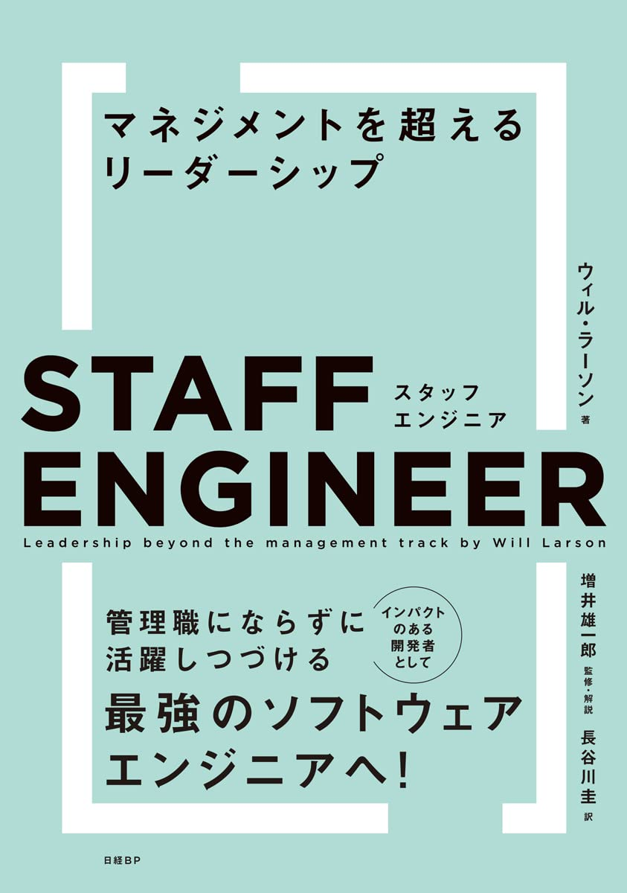
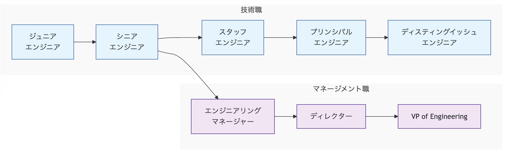

# SREとしてスタッフエンジニアを目指す

### tjun

2025-1-26 | SRE Kaigi 2025

---

<!--
header: SREとしてスタッフエンジニアを目指す | tjun
-->

# はじめに

## SREとしてスタッフエンジニアを目指す話をします。

- スタッフエンジニアの定義や期待値は組織によって異なるので、あくまで一例として聞いて下さい
- SREの役割も組織によっていろいろありますが、システムの信頼性と基盤のOwnerのようなSREを想定しています
- SREのキャリアを考える助けになれば幸いです

---
# 自己紹介

## tjun
- Junichiro Takagi
- X: [@tjun](https://x.com/tjun)
- いまはnewmo株式会社でEngineerをやっています

## 経歴

| 2015~2018 | インフラエンジニア |
| --- | --- |
| 2018/04 | SREとしてメルペイに入社 |
| 2018/10 | Engineering Managerになる|
| 2023/07 | EMをやめてICに戻る |
| 2023/12 | Principal Engineerになる |

---

# Contents
今日の話の流れ

- スタッフエンジニアとは
- SREのスタッフエンジニアの役割
- SREのスタッフエンジニアに求められること
- スタッフエンジニアになるために
---

<!--
header: スタッフエンジニアとは
-->

# スタッフエンジニアとは

---

# スタッフエンジニアとは

- 組織全体の技術的成功をリードする技術職
- 影響範囲がチームだけでなく組織全体に及ぶ
- マネージメントではなく、技術的なリーダーシップを担う

---

# エンジニアのキャリアパス

---

# 役割の違い

### スタッフエンジニア
技術的な戦略とアーキテクチャの意思決定を主導し、組織全体の技術的な方向性を示す技術リーダー
### エンジニアリングマネージャー
エンジニアチームの人材育成・評価・採用を含むマネジメントと、チームの生産性・健全性を確保する組織リーダー
### (Tech)プロダクトマネージャー
(技術的な知見を活かしながら、)プロダクトの要件定義・優先順位付け・ロードマップ策定を行うプロダクトリーダー

---

# スタッフエンジニアの4つのタイプ

1. テックリード
役割: チームやプロジェクトの技術的なリーダーとして、技術的ビジョンの策定や実行を担当します。

2. アーキテクト
役割: システム設計や技術戦略を担い、特定分野の方向性を決定します。

3. ソルバー（Solver）
役割:  複雑で困難な問題を解決する専門家

4. 右腕（Right Hand）
役割: 経営層（例: CTO）の補佐として機能し、組織全体の重要課題に取り組む

---

# SREのスタッフエンジニアのタイプ

テックリードに加えてアーキテクト的な要素がSREのスタッフエンジニアには期待されている

---

# SREならではの特徴はある？

---

# SREチームの組織的な特徴

- 共通のインフラやシステムに関わる
- エンジニア組織全体に関わることが期待されている
- （日本では）専任のPMが不在のことが多い

---

# SREチームの組織的な特徴

- 共通のインフラやシステムに関わる
- エンジニア組織全体に関わることが期待されている
→ SREならスタッフエンジニアとか関係なく組織全体に関わる

- （日本では）専任のPMが不在のことが多い
→ PM的なことをだれかがやらないといけない

## SREのリーダー的なことをやっていれば、自動的にスタッフエンジニアになるのでは？

---

# SREのスタッフエンジニアに期待されること

## システムの信頼性に関わる取り組みを組織に対してリードする

1. 信頼性に関する技術的な意思決定
  - サービスレベル目標(SLO)の設定と監視
  - システムアーキテクチャの設計やレビュー
  - 開発・運用ガイドラインの策定
  - コスト最適化

2. 組織的な問題解決とコミュニケーション
  - システム障害の調査と再発防止
  - インシデント対応プロセスの策定と改善
  - ステークホルダーや経営層とのコミュニケーション

---
# Contents

- スタッフエンジニアとは
- SREのスタッフエンジニアの役割
- SREのスタッフエンジニアに求められること
- スタッフエンジニアになるために

---

<!--
header: SREのスタッフエンジニアの役割
-->

# SREにおけるスタッフエンジニアの役割

---

# SREにおけるスタッフエンジニアの役割

##  システムの信頼性に関わる取り組みを組織に対してリードする

1. 信頼性に関する技術的な意思決定
2. 組織的な問題解決

---

# 信頼性に関する技術的な意思決定とは

---

# システムやガイドラインの設計を行う

1. デザインドキュメントを書く
2. ステークホルダーと議論して承認を得る
3. 設計をもとに開発・構築する

たとえば
- 画像配信システムの設計
- 本番データベースオペレーションの設計とガイドラインの作成
- アラートの通知の設計とアラート対応ガイドラインの制定

---

# デザインドキュメントをレビューする

## SREとしてレビューするときのポイント

- Why: なぜ必要なのか？既存のものではダメなのか？
- Alternative: 他の選択肢はないか？（Managedサービスを使うなど）
- Operability: 運用のOwnerは誰か、運用負荷や運用コストはどうか
- Capacity & Scalability: 負荷は問題ないか、スケールする仕組みか
- Security: セキュリティ的に問題ないか

>>> 参考: SREcon19 Asia/Pacific - Reliable by Design (Laura Nolan, Slack)

---

# ガイドラインの作成

## 開発組織におけるガイドラインを作成する

- 本番環境のオペレーションのガイドライン
- 障害対応フロー

---

# インシデント対応

インシデント対応をリードする際には、以下のような動き方があります。

- インシデントコマンダーとして、インシデントの影響範囲や対応計画などを整理して、組織に対して報告する
- 困難なインシデントにおいて原因調査と対応をリードする
- 振り返りを開催して、再発防止策の実施を促す

---

# 長期的なプロジェクトのリード

## 組織やシステムの重要な課題を、長期的な目線を持って取り組む

- システムのコンテナ化、Kubernetesの導入
- Disaster Recoveryの設計
- インフラのコスト最適化

---
# 組織に対するコミュニケーション

スタッフエンジニアは、SREとして取り組む課題を共有したり組織を巻き込んでプロジェクトを進めるために、
他のチーム、ステークホルダーや、経営層とのコミュニケーションが求められます。

---

# 組織に対するコミュニケーション

## SRE文化の醸成

SLOやエラーバジェットという考え方を組織に浸透させる

---

# 組織に対するコミュニケーション

## インフラコストについて経営層に説明する

どこにどれだけのコストがかかっていて、なぜ増えたのかを説明する。
- たとえばObservabilityのSaaSのコストの妥当性を説明する
- コスト削減のための施策を提案する

---

# 組織に対するコミュニケーション

## 現在のシステムの課題とトレードオフについて説明する

- 実はCDNがSPoFになっているので、CDNに障害が起きるとサービスがダウンします
- 解決するには、
---

# Contents

- スタッフエンジニアとは
- SREのスタッフエンジニアの役割
- SREのスタッフエンジニアに求められること
- スタッフエンジニアになるために

---

<!--
header: SREのスタッフエンジニアに求められること
-->

# SREスタッフエンジニアに求められる能力

---

# SREスタッフエンジニアに求められる能力

## マインド
- 責任感
- 計画と実行する力

## 技術
- 技術的知見と広範な経験
- システム設計とアーキテクチャの専門知識

## コミュニケーション
- 組織的な影響力の行使能力
- ステークホルダーマネジメント

---

# Contents

- スタッフエンジニアとは
- SREのスタッフエンジニアの役割
- SREのスタッフエンジニアに求められること
- スタッフエンジニアになるために

---

<!--
header: スタッフエンジニアになるために
-->

# SREのスタッフエンジニアになるために

---

# SREのスタッフエンジニアになるために

## とにかく打席に立つ

SREのスタッフエンジニアになるためには、とにかく打席に立つことが大事です。

---

# SREのスタッフエンジニアになるために

## いろいろな打席に立つ

1. 信頼性に関する課題の優先度を決める
2. 課題解決の計画をする
3. 計画を実行する
4. 計画の結果を報告する

これを先頭に立ってやる

---

# どんな打席がある？

## たとえばインシデント対応

---

# どんな打席がある？

## たとえば新しいシステムの設計・構築して運用する

---

# 大事な考えかた

- 他の人に負けない分野を持つ / 同じことばかりやらない
- 優先度を意識する
- トレードオフを意識する

---

# おわりに

SREのスタッフエンジニアという役割について、いろいろとお話しました。
誰かの参考になれば幸いです。
懇親会やSNS等で、気軽に相談してください。

---

# おまけ

---

# よくある質問 1

## マネージメントしたくない人はスタッフエンジニアを目指すのがよい？

---

# よくある質問 1

## マネージメントしたくない人はスタッフエンジニアを目指すのがよい？

スタッフエンジニアは、SREチームやエンジニア組織のロードマップ策定やプロジェクトの管理、ステークホルダーとのコミュニケーションなど、マネージメントの要素が求められます。
人のマネージメント（採用・評価・アサイン）はEMの仕事ですが、チームメンバーの育成や採用への貢献はスタッフエンジニアに期待されます。
ですので、マネージメントしたくない人はスタッフエンジニアを目指すのがよいとは言えません。

---

# よくある質問 2

## コードだけ書いていたい人のキャリアパスはないの？

---

# よくある質問 2

## コードだけ書いていたい人のキャリアパスはないの？

スタッフエンジニアの本では、ソルバー（Solver）タイプのスタッフエンジニアが紹介されています。
組織において困難な問題を解決することが期待されており、高いエンジニアリング力を発揮することで評価されます。
また、大きな会社では、職種がより専門的な領域に分かれていたりするので、エンジニアリングだけやってもある程度上にいけるキャリアパスがあると思います。

---

# よくある質問 3

## 一度エンジニアリングマネージャーになるとスタッフエンジニアになれないの？

---

# よくある質問 3

## 一度エンジニアリングマネージャーになるとスタッフエンジニアになれないの？

自分はエンジニアリングマネージャー（EM）になってからスタッフエンジニアになりました。
EMを経験することで、より経営層に近い目線を持てたり会社の中で期待されることが分かるので、スタッフエンジニアになる上で遠回りということもないかと思います。

---

# よくある質問 4

## スタッフエンジニアになるとなにがうれしいの？コード書く時間が減るし大変そう

- 給料が増えます
- 組織にとって重要な課題に対して、自分の考えを入れながら組織を巻き込んで取り組み、より大きな影響を与えることができるのは、やりがいがあって面白いと思います

