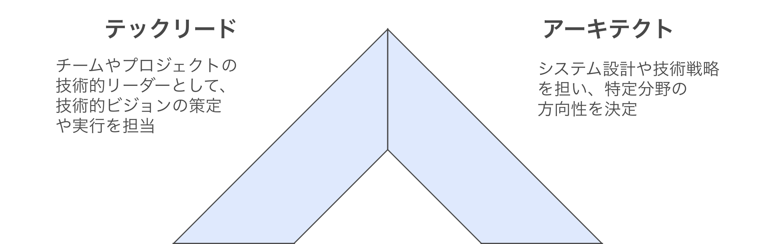
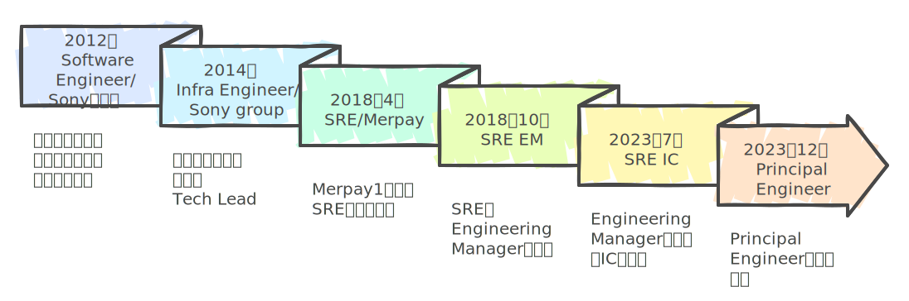
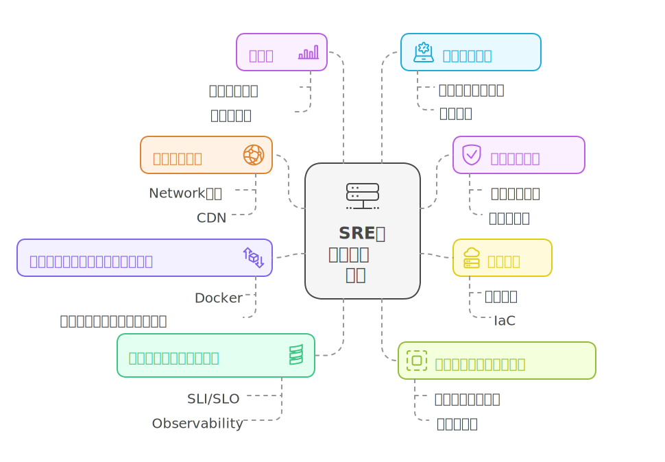

<!-- paginate: false -->

# SREとしてスタッフエンジニアを目指す

### tjun

2025-1-26 | SRE Kaigi 2025

---

<!--
header: SREとしてスタッフエンジニアを目指す | tjun
footer: 2025-1-26 | SRE Kaigi 2025
paginate: true
-->

# はじめに

## SREとしてスタッフエンジニアを目指す話をします。

- スタッフエンジニアの定義や期待値は組織によって異なるので、あくまで一例として聞いて下さい
- SREの役割も組織によっていろいろありますが、会社のプロダクトの信頼性に関わるようなSREを想定しています
- SREのキャリアを考える助けになれば幸いです

---
# 自己紹介

## tjun
- Junichiro Takagi
- X: [@tjun](https://x.com/tjun)
- 元メルペイSRE, Principal Engineer, Engineering Manager
- いまはnewmo株式会社でIC(Individual Contributor)をやっています

---

# Contents
今日の話の流れ

- スタッフエンジニアとは
- SREのスタッフエンジニアの役割
- SREのスタッフエンジニアに求められること
- スタッフエンジニアになるために
---

<!--
header: スタッフエンジニアとは
-->

# スタッフエンジニアとは

---

# スタッフエンジニアとは

* 組織全体の技術的成功をリードする技術職
* 影響範囲がチームだけでなく組織全体に及ぶ
* マネージメントではなく、技術的なリーダーシップを担う

---

# エンジニアのキャリアパス

---

# エンジニアの評価と役割の変化

- 重要なのは、技術力ではなく、会社への貢献度
- 上司だけでなく、チームメンバーや他チームからの信頼も重要
- 評価が上がると期待値も上がり役割も変化する
  - より大きく・長期的で・不確実な課題に取り込む
  - コードを書く時間は減る

---

# スタッフエンジニアになるとなにがうれしい？

- 影響力と責任と給料が増える
- 組織を巻き込んで重要な課題に取り組み、より大きな影響を与えることができるのは、やりがいがあって面白いと自分は思います
- みんながスタッフエンジニアを目指す必要はないです

---

# リーダーの役割の違い

### スタッフエンジニア
技術的な戦略とアーキテクチャの意思決定を主導し、組織全体の技術的な方向性を示す技術リーダー
### エンジニアリングマネージャー(EM)
チームの人材育成・評価・採用を含むマネジメントと、チームの生産性・健全性を確保する組織リーダー
### Techプロダクトマネージャー（TPM）
技術的知見を活かしてプロダクトの要件定義・優先順位付け・ロードマップ策定を行うプロダクトリーダー

---

<!-- # スタッフエンジニアの4つのタイプ

1. テックリード
役割: チームやプロジェクトの技術的なリーダーとして、技術的ビジョンの策定や実行を担当します。

2. アーキテクト
役割: システム設計や技術戦略を担い、特定分野の方向性を決定します。

3. ソルバー（Solver）
役割:  複雑で困難な問題を解決する専門家

4. 右腕（Right Hand）
役割: 経営層（例: CTO）の補佐として機能し、組織全体の重要課題に取り組む

---
-->

# スタッフエンジニアの4つのタイプ

---

# SREのスタッフエンジニアの特徴は？

---

# SREのスタッフエンジニアのタイプ

テックリードに加えてアーキテクトの要素が期待される

---

# SREチームの組織的な特徴

- 共通のインフラやシステムに関わる
- エンジニア組織全体に関わることが期待されている
- （日本では）専任のTPMが不在のことが多い

---

# SREチームの組織的な特徴

- 共通のインフラやシステムに関わる
- エンジニア組織全体に関わることが期待されている
- （日本では）専任のTPMが不在のことが多い

### →SREのリーダー的なことをやっていれば、組織に関わるプロジェクトをリードすることになるので、自動的にスタッフエンジニアになるのでは...？

---

# 自分のキャリアパス

---

# Contents

- スタッフエンジニアとは
- SREのスタッフエンジニアの役割
- SREのスタッフエンジニアに求められること
- スタッフエンジニアになるために

---

<!--
header: SREのスタッフエンジニアの役割
-->

# SREにおけるスタッフエンジニアの役割

 

---

# SREにおけるスタッフエンジニアの役割

## → 組織の信頼性を導く技術リーダー

---

# SREにおけるスタッフエンジニアの役割

1. 信頼性に関する問題解決と意思決定
2. 信頼性に関するコミュニケーションのリード
3. 信頼性に関する基準と文化作り

---

<!-- #### SREにおけるスタッフエンジニアの役割
# 信頼性に関する問題解決と意思決定

- システムのアーキテクチャや技術の選定
- インシデント対応のリード
- 組織レベルのプロジェクトのリード

---

#### SREにおけるスタッフエンジニアの役割
# 信頼性に関するコミュニケーションをリードする

- SREが行っているプロジェクトの進捗を組織に報告する
- インフラコストの理由と今後の削減案について経営陣に説明する

---

#### SREにおけるスタッフエンジニアの役割
# 信頼性に関する基準と文化を作る

- SLOを組織に導入する
- インシデント対応ガイドラインを制定する

---
-->

# SREにおけるスタッフエンジニアの役割

1. 信頼性に関する問題解決と意思決定
2. 信頼性に関するコミュニケーションのリード
3. 信頼性に関する基準と文化作り

→ SREのスタッフエンジニアの仕事の例を紹介します

---

<!--
header: SREスタッフエンジニアの仕事の例
-->

信頼性に関する問題解決と意思決定 + 組織的な信頼性の基準と文化作り

# システムやガイドラインの設計を行う

1. デザインドキュメントを書く
2. ステークホルダーと議論して承認を得る
3. 設計をもとに開発・構築する
4. 組織に適用する

 

たとえば
- 本番データベースオペレーションの設計とガイドラインの作成
- アラートの通知の設計とアラート対応ガイドラインの制定

---

信頼性に関する問題解決と意思決定
# デザインドキュメントをレビューする

チームメンバや他のチームが書いたデザインドキュメントを、以下のような観点でレビューします。

- Why: なぜ必要なのか？ 既存のものではダメなのか？
- Alternative: 他の選択肢はないか？（Managedサービスを使うなど）
- Operability: 運用のOwnerは誰か、運用負荷や運用コストはどうか
- Capacity & Scalability: 負荷は問題ないか、スケールする仕組みか
- Security: セキュリティ的に問題ないか

>>> 参考: SREcon19 Asia/Pacific - Reliable by Design (Laura Nolan, Slack)

---

信頼性に関する問題解決と意思決定
# インシデント対応

インシデント対応をリードして、早期解決や再発防止を促す

- インシデントコマンダーとして問題の解決をリードし、影響範囲や対応状況などを整理・報告する
- 困難なインシデントにおいて原因調査と対応をリードする
- 振り返りを開催して、再発防止策の実施を促す

---

信頼性に関する問題解決と意思決定 + 信頼性に関わるコミュニケーション
# 信頼性に関わるプロジェクトのリード

- 組織やシステムの重要な課題を、長期的な目線を持って取り組む
- プロジェクトの目的や取り組み、成果を組織に報告する

 

プロジェクトの例
- システムのクラウド移行
- Kubernetesの導入
- インフラのコスト最適化

---

信頼性に関わるコミュニケーション
# インフラコストについて経営層に説明する

組織が利用しているインフラのコストについて、その内訳や増加の理由を説明する。
- たとえばObservabilityのSaaSのコストの妥当性を説明する
- コスト最適化のための施策を提案する

---

信頼性に関わるコミュニケーション
# 現在のシステムの課題について経営陣に説明する

システムが抱えるリスクと、解決するためのコストのトレードオフを説明する。

- データベースのインスタンスを動かしているリージョンに障害が起きると、サービスがダウンします
- 解決するには、ダウンタイムを許容してバックアップを別のリージョンでリストアするか、マルチリージョンで動作するアーキテクチャへの移行が必要です
- マルチリージョンで動作するアーキテクチャは、コストがxx円でレイテンシも増加します

---

組織的な信頼性の基準と文化作り
# SRE文化の醸成

- SLOやエラーバジェットという考え方を組織に浸透させる
- オンコール対応の体制を構築する

---

### まとめ

# SREのスタッフエンジニアの役割とは

組織の信頼性を導く技術リーダーとして、組織を巻き込んで信頼性に関わる課題解決を行うこと

---

# Contents

- スタッフエンジニアとは
- SREのスタッフエンジニアの役割
- SREのスタッフエンジニアに求められること
- スタッフエンジニアになるために

---

<!--
header: SREのスタッフエンジニアに求められること
-->

# SREスタッフエンジニアに求められること

なにができたらSREのスタッフエンジニアになれるのか？

---

# SREスタッフエンジニアに求められること

会社ごとに、昇格の目安となるキャリアラダーのような定義があります。

---

# SREスタッフエンジニアの定義の事例: GitLab

<!-- footer: "" -->

1. 技術力
GitLabと4つの専門領域における深い知識、革新的なソリューションの創出能力
2. 実行力
組織全体に影響を与えるアーキテクチャ変更の推進と会社の重要プロジェクトのリード
3. コミュニケーション
複数チーム間の技術的な合意形成と原因分析の推進、エンジニアリング組織全体への影響力行使
4. 影響力と成熟度
チームメンバーの育成支援と技術的メンタリング、詳細な技術文書作成による知見共有

>>> https://handbook.gitlab.com/job-families/engineering/infrastructure/site-reliability-engineer/#staff-site-reliability-engineer

---

# SREスタッフエンジニアの定義の事例: Dropbox

1. Results（成果）
複数チーム/部門に影響を与える機会の特定と実行、厳しい制約下での大規模プロジェクトの遂行
2. Direction（方向性）
全社的優先順位と技術的制約を考慮した長期ビジョンの策定と組織変革の推進
3. Talent & Culture（人材・文化）
チームメイトのメンタリングと知識共有、部門を超えた協力関係の構築、包括的な環境作り
4. Craft（技術力）
信頼性目標の定義、システムの各層への深い理解、システム全体の健全性とエンジニアリング品質の管理

>>> https://dropbox.github.io/dbx-career-framework/ic5_staff_reliability_engineer.html

---

# SREスタッフエンジニアに求められる能力

1. 技術力と実行力
- 高い技術的な知識と広範な経験
- チームを超えたプロジェクトのリード

 

3. 戦略的な思考
- 長期的な視点と不確実性への対応
- 優先順位とトレードオフの理解

2. コミュニケーションと信頼感
- 組織的な影響力と経営陣からの信頼
- 後継者の育成と知識の共有

---

<!--
header: スタッフエンジニアになるために
footer: 2025-1-26 | SRE Kaigi 2025
-->

# Contents

- スタッフエンジニアとは
- SREのスタッフエンジニアの役割
- SREのスタッフエンジニアに求められること
- スタッフエンジニアになるために

---

<!--
header: スタッフエンジニアになるために
-->

# SREのスタッフエンジニアになるために

どうやったらSREのスタッフエンジニアになれる？

---

# スタッフエンジニアになるために

## 階段を登る

- 問題を解決する
- 少しずつ成長する
- 少しずつ大きな問題に挑戦する
- 少しずつ信頼を得る

---

# スタッフエンジニアになるための4つのポイント

- 技術的成長
- 影響力の拡大
- リーダーシップの発揮
- マインドセット

---

# SREとしての技術的な成長

---

# SREとしての技術的な成長

- SREの技術領域は広く、全てを極めることは難しい
- でも他チームのエンジニアは、詳しいことを期待している
- 会社のシステムにおいて、分からないことをなくしていこう
- システム全体を見渡せる広い知識に加えて、自分の得意な分野を作ろう

---

# 影響力の拡大
## SREを代表して、組織に発信する

- ドキュメントを書いてチームに知識を共有
- チームやプロジェクトの成果を組織に報告
- SREの考えを広める活動をしよう

---

# リーダーシップの発揮

## 先頭に立つと、自分の成長も加速する

- インシデント対応のリード
- チームメンバーのメンタリング
- 知見の共有とドキュメント化

---

# 成功のためのマインドセット

## 視野を広げる

- 組織の成功へ貢献することを意識する
- 長期的な視点での判断
- トレードオフと優先順位を意識する

---

# SREのスタッフエンジニアになるために

---

# 今日のまとめ

- SREのスタッフエンジニアとは、組織の信頼性を導く技術リーダー
- 技術力、実行力、コミュニケーションや影響力が求められる
- 信頼性に関わる課題解決を先頭でやれば、信頼や影響力はあとからついてくる

---

# おわりに

SREのスタッフエンジニアという役割について、自分の考えを話しました。
キャリアや働き方は人それぞれです。スタッフエンジニアを目指すことが良いとは限りません。
SREのキャリアを考える参考になれば幸いです。

---

# おまけ

---

# よくある質問 1

## マネージメントしたくない人はスタッフエンジニアを目指すのがよい？

---

# よくある質問 1

## マネージメントしたくない人はスタッフエンジニアを目指すのがよい？

スタッフエンジニアは、SREチームやエンジニア組織のロードマップ策定やプロジェクトの管理、ステークホルダーとのコミュニケーションなど、マネージメントの要素が求められます。
人のマネージメント（採用・評価・アサイン）はEMの仕事ですが、チームメンバーの育成や採用への貢献はスタッフエンジニアにも期待されます。
そのため、マネージメントしたくない人はスタッフエンジニアを目指すのがよいとは言えません。

---

# よくある質問 2

## コードだけ書いていたい人のキャリアパスはないの？

---

# よくある質問 2

## コードだけ書いていたい人のキャリアパスはないの？

スタッフエンジニアの本では、ソルバー（Solver）タイプのスタッフエンジニアが紹介されています。
組織において困難な問題を解決することが期待されており、高いエンジニアリング力を発揮することで評価されます。
また、大きな会社では、職種がより専門的な領域に分かれていたりするので、エンジニアリングだけやってもある程度上にいけるキャリアパスがあると思います。

---

# よくある質問 3

## 一度エンジニアリングマネージャーになるとスタッフエンジニアになれないの？

---

# よくある質問 3

## 一度エンジニアリングマネージャーになるとスタッフエンジニアになれないの？

自分はエンジニアリングマネージャー（EM）になってからスタッフエンジニアになりました。
EMを経験することで、より経営層に近い目線を持てたり会社の中で期待されることが分かるので、スタッフエンジニアになる上で遠回りということもないかと思います。

